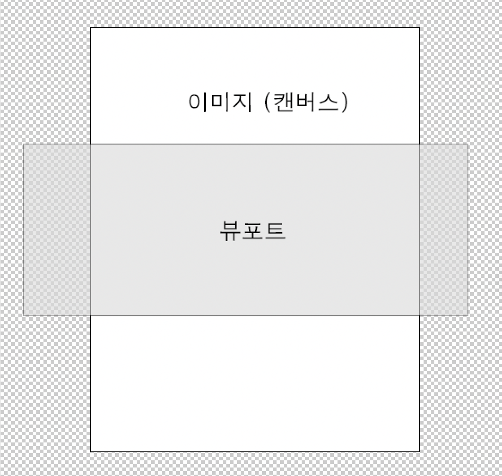

# 스튜디오/fabric.js에 관해

---

## fabric.js

- 스튜디오는 fabric.js 라이브러리를 사용하여 개발되었습니다.
- http://fabricjs.com/

### fabricCanvas.ts

- `src/components/studio/fabricCanvas.ts`에 fabric.js를 사용한 기능들이 구현되어있습니다.
- 외부에서 canvas 객체 (fabric.Canvas)에 접근할 수 없으니 다른 기능이 필요하면 이곳에 메소드를 정의해주세요.

### editor

- 캔버스 영역은 `src/components/studio/studio_editor.tsx`의 canvas element입니다.
- 텍스트 메뉴는 `src/components/editor/editor_tool.tsx`에 있습니다.

### 캔버스 사이즈와 css 사이즈



- canvas api는 css 사이즈와 캔버스 사이즈가 별도입니다.
- 실제로 보이는 사이즈는 css로 보여지는 영역이며 react state로 관리되고 있습니다. (브라우저 사이즈에 따라 영역 크기가 다르기 때문)
- 리사이즈 할 때마다 해당 영역이 변경되고 있습니다.

```ts
//studio_editor.tsx
const [canvasSize, setCanvasSize] = useState({ width: 842, height: 428 });
```

- 실제 사이즈는 이미지의 크기와 동일하며, css 사이즈보다 클 경우 비율에 맞게 축소하고 있습니다. (혹은 화면 맞춤 비율을 누르면 이 비율로 보여줍니다.) `FabricCanvas` 클래스 안 scaleFactor에 저장되어 있습니다. 구하는 공식은 다음과 같습니다.

```ts
const widthRatio = this.maxWidth / this.originalImgSize.width;
const heightRatio = this.maxHeight / this.originalImgSize.height;

this.scaleFactor = Math.min(widthRatio, heightRatio);
```

- 동시에 가운데 정렬도 하고 있습니다. 공식은 다음과 같습니다.

```ts
const x = this.maxWidth / 2 - (this.originalImgSize.width * scaleFactor) / 2;
const y = this.maxHeight / 2 - (this.originalImgSize.height * scaleFactor) / 2;
```

### 실행 취소

- 실행 취소 로직에 사용되는 `history`라는 명칭은 실제 앱에서 사용하는 작업 내역과 별개로 오직 실행 내역을 다루는 이름입니다.
- fabric.js에서 내보낸 json 을 배열에 순서대로 저장하고(현재 개수 제한 없음) 인덱스 값을 실행 취소 할 때마다 -1 합니다.
- STUDIO 에서 다른 페이지로 이동해도 캔버스 영역이 유지되도록 관련 값은 모두 jotai를 통해 관리되고 있습니다.
- 컴포넌트가 마운트 될 때마다 초기화를 해줍니다.
- 다른 페이지에서 돌아왔을 때, 우측의 히스토리를 불러왔을 때는 실행 내역도 초기화 하고 있습니다.

### 이미지 오브젝트

- 현재 기준으로 배경 이미지는 s3의 이미지 url에서 base64로 변환 후 fabric canvas에 추가한 후, 서버에 저장(json 추출)할 때는 배경 이미지를 제거하고 있습니다.
- 이미지 오브젝트를 추가해야 하는 경우 이미지의 CORS 문제를 해결하고, 이미지 url을 포함하여 json으로 내보낼 수 있어야 합니다.

### 텍스트박스 오브젝트

#### 텍스트 박스 추가

```ts
public addText(text: string, textOptions?: TextOptions, source: 'COPY' | 'USER' = 'USER') {
    const fabricText = new fabric.Textbox(text, {
      ...(textOptions ? textOptions : this.textOptions),
      editable: true,
      dirty: true,
      borderColor: '#5771FF',
      cornerColor: '#fff',
      cornerStrokeColor: '#5771FF',
      transparentCorners: false,
      cornerSize: 8,
      source,
      // scaleX: 1 / this.scaleFactor,
      // scaleY: 1 / this.scaleFactor, 뷰포트 기준으로 폰트 크기 설정하려면 주석 해제
    } as CustomTextBox);

    fabricText.setControlsVisibility({
      mt: false, // 중앙 상단 컨트롤 숨김
      mb: false, // 중앙 하단 컨트롤 숨김
    });

    this.canvas?.add(fabricText);

    this.canvas?.setActiveObject(fabricText);
  }
```

- source: '텍스트 입력'으로 사용자 텍스트를 입력했을 경우 `USER`, 우측에 생성된 카피를 선택해서 입력되었을 경우엔 `COPY`로 다르게 저장하지만 이 값을 현재는 따로 사용하고 있지는 않습니다.
- textOptions에 들어갈 수 있는 값은 다음과 같습니다.

```ts
export type TextOptions = Pick<
  fabric.ITextboxOptions,
  | 'fontFamily'
  | 'fill'
  | 'fontSize'
  | 'fontStyle'
  | 'fontWeight'
  | 'textAlign'
  | 'underline'
  | 'linethrough'
  | 'textBackgroundColor'
  | 'left'
  | 'top'
  | 'scaleX'
  | 'scaleY'
  | 'text'
>;
```

#### 폰트 사이즈

- 텍스트박스를 드래그 해서 크기를 수정하면, 텍스트 오브젝트의 폰트 사이즈도 비율에 맞게 조정됩니다.

```ts
// fabricCanvas.ts
this.canvas.on('object:modified', (e: fabric.IEvent) => {
  const obj = e.target;

  if (obj && obj.type === 'textbox') {
    const textbox = obj as fabric.Textbox;
    const scaleX = textbox.scaleX!;
    const scaleY = textbox.scaleY!;

    textbox.fontSize! *= Math.sqrt(scaleX * scaleY);
    textbox.width! *= scaleX;
    textbox.height! *= scaleY;

    textbox.scaleX = 1;
    textbox.scaleY = 1;

    textbox.setCoords();
  }
});
```

- 해당되는 비율만큼 폰트 사이즈를 키우고 텍스트박스의 가로, 세로 사이즈도 조절하고 scaleX와 scaleY는 원상복구합니다.
- 캔버스를 클릭했을 때 활성화된 오브젝트가 있을 경우 해당 텍스트 오브젝트의 텍스트 옵션을 가져옵니다.

```ts
// studio_editor.tsx

const handleClickCanvas = () => {
  if (isTextSelected) {
    handleTextCursor();
  } else {
    const targetObject = fabricCanvas?.getActiveObject();
    if (targetObject && targetObject instanceof fabric.Textbox) {
      const {
        fontFamily,
        fontSize,
        textAlign,
        fontStyle,
        fill,
        underline,
        linethrough,
        textBackgroundColor,
        fontWeight,
      } = targetObject;

      setTextOptions({
        fontFamily,
        fontSize,
        textAlign,
        fontStyle,
        fill,
        underline,
        linethrough,
        textBackgroundColor,
        fontWeight,
      });
    }
  }
};
```

### 이미지로 저장

- 캔버스를 이미지로 저장할 때 현재 화면의 확대비율과 다를 수 있기 때문에 보이지 않는 캔버스를 새로 초기화 한 후 저장하고 있습니다.

```ts
// fabricCanvas.ts
  const tempCanvas = new fabric.Canvas(null);

      tempCanvas.setWidth(this.canvasSize.width);
      tempCanvas.setHeight(this.canvasSize.height);

      const jsonData = this.canvas.toJSON();

      tempCanvas.loadFromJSON(jsonData, () => {
        tempCanvas.forEachObject(
          (
            obj: fabric.Object & {
              left?: number;
              top?: number;
              scaleX?: number;
              scaleY?: number;
            },
          ) => {
            obj.setCoords();
          },
        );

        tempCanvas.setWidth(this.originalImgSize.width);
        tempCanvas.setHeight(this.originalImgSize.height);
```

### 이벤트 관리

- 이벤트 종류 http://fabricjs.com/events
- fabricCanvas.ts constructor에 추가

## studioAtoms.ts

`src/components/atoms/studioAtom.ts`

- 스튜디오에서 전체적으로 이 작업에 대해 사용하는 atoms입니다.
- `textOptionsAtom`이 텍스트 옵션입니다.
